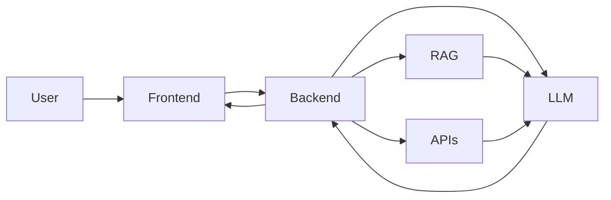

# Problem Statement 1

## Q1. API Data Retrieval and Storage

You are tasked with fetching data from an external REST API, storing it in a local SQLite database, and displaying the retrieved data. The API provides a list of books in JSON format with attributes like title, author, and publication year.

**Implementation:** [`task1_books_api_sqlite.py`](./task1_books_api_sqlite.py)

I used an Open Library API to fetch the data in JSON Format .The code retrieves the title,author and publication year and store them in SQLite database using queries. After inserting the data it extracts them from the database and displays them. I also have added an API error handling by including a 10 sec timeout with a status check. I made sure records are cleared before inserting the latest API response as it kept on appending after every new run. 

---

## Q2. Data Processing and Visualization

Given a dataset containing information about students' test scores, fetch the data from an API, calculate the average score, and create a bar chart to visualize the data.

**Implementation:** [`task2_student_scores.py`](./task2_student_scores.py)
I fetched student score data from a REST API and took the first 10 student so the displayed chart is easy to read from the top for the example .The code retrieves the name and maths score, take its average score and displays each students using a horizontal bar chart.I used an error handling same like Q1 in this also.
API used : Sling Academy Student Score dataset
Visual: Matplotlib horizontal bar chart
---

## Q3. CSV Data Import to a Database

Write a Python script that reads data from a CSV file containing user information (e.g., name, email) and inserts it into a SQLite database.

**Implementation:** [`task3_csv_to_sqlite.py`](./task3_csv_to_sqlite.py)

**CSV File:** [`users.csv`](./users.csv)

Python CSV module was used to read the user information from user.csv I made using DictReader.The code creates a SQLite database and store each user's name and email using SQL queries which after inserting , it queries it and displays the stored data.
As the CSV file exist and the data is duplicated after each run , I made  sure the records are cleared bore every insert.
---

## Q4. Most Complex Python Code

[Authentication Anomaly Detection and Risk Scoring Model](https://github.com/jaden-mas1010/Design-of-an-Authentication-Anomaly-Detection-and-Risk-Scoring-Model-)

This is the most complex Python project I have worked on. I built an authentication anomaly detection system that combines a 12-rule detection engine with an Isolation Forest model to identify suspicious login behaviour. The system calculates a composite risk score, provides reasons behind the score, exposes the functionality through FastAPI, stores authentication data in SQLite, and includes 34 passing pytest tests.

I consider it my most complex Python project because it combines backend development, security detection logic, machine learning, database operations and testing within one system.

---

## Q5. Most Complex Database Code

[Employee Device & Login Analysis — SQL Project](https://github.com/jaden-mas1010/SQL-PROJECT)

This project uses SQL to analyse employee, device and login data. I wrote queries using aggregations, GROUP BY, HAVING, INNER JOIN, LEFT JOIN and window functions with PARTITION BY to connect employee and device information and analyse login activity.

The more advanced queries use window functions and grouped data to compare login behaviour and identify unusual activity rather than only retrieving individual records.

---

# Problem Statement - Assignment 2

## Q1. Where would you rate yourself on LLM, Deep Learning, AI and ML?

| Area | Rating |
|---|---|
| LLM | B |
| Deep Learning | C |
| AI | B |
| ML | B |

I rated myself B in LLMs because I understand the main concepts and have worked with LLM APIs and AI-assisted applications, but I would still need guidance for more advanced areas such as fine-tuning and production-scale LLM systems.

I rated myself C in Deep Learning because I understand the basic concepts of neural networks as it and Deep Learning was part of my MSc module, but I have limited practical experience building and training deep learning models myself.

For AI and ML, I rated myself B because I have practical experience applying ML through my authentication anomaly detection project, where I used Isolation Forest and hav alongside a rule-based risk scoring approach and a coursework for my master on a fraudulent credit card detection project using Random Forest. I can work with these concepts and implement them, but I am still developing deeper experience with model selection, tuning and larger production ML systems.

---

## Q2. What are the key architectural components to create a chatbot based on LLM? Please explain the approach on a high-level

### Overall Approach

For this architecture, my goal is to take the user's question, understand the context, fetch the required information depending on the user's permissions, generate a relevant response and return it safely to the user.

### Frontend

The frontend is the main interface that interacts with the user, receives their query, sends it to the backend and is also responsible for displaying the final response by the system.

### Backend

The backend is the main orchestrator where it initially receives the request from the frontend, checks the authentication and authorization of the user and if it is allowed to access the requested information. It decides whether the question can be answered directly by the LLM or whether additional information is required through RAG or an external API/tool.It assembles the system prompt, context and chat history, and sends a clean request to the LLM. Security controls should be enforced at this layer.

### RAG

RAG helps when the request requires information outside the LLM’s built-in knowledge or available context.

Before retrieval, documents are split into smaller chunks, converted into numerical embeddings using an embedding model, and stored in a vector database.

When the user asks a question, the query is also converted into an embedding. The query embedding is then used to search the vector database for semantically similar document chunks. The most relevant chunks are retrieved and passed to the LLM as additional context to help generate a grounded response.

This helps reduce reliance on the LLM's knowledge and the chatbot to answer using information from an organization's own documents.

### External APIs / Tools

When a user’s request requires a specific action, such as adding a reminder to a calendar, the system can select the appropriate API or tool to perform the requested task. The LLM can help determine which action or tool is required, but the backend should validate the user’s permissions and control the actual execution.

### Conversation Memory

Conversation memory helps maintain the history and context of the chat so that the user does not have to repeat everything continuously. This is managed by the backend, which can maintain recent messages or summarize older chat history to provide relevant context to the LLM.

### LLM

The LLM is responsible for understanding the instructions, context and rules given by the backend and generating the natural language response. It can receive the system instructions, user query, relevant conversation history and information retrieved through RAG.

### Security and Guardrails

Security and guardrails help make sure the user only gets access to the information or actions they are allowed to. Authentication checks who the user is, while authorization checks what the user is allowed to access or perform. Additional guardrails can also protect sensitive data, RAG and external tools from risks like prompt injection or unauthorized access.

Retrieved documents and tool outputs should also be seen as untrusted input because they may contain malicious or misleading instructions.

### Logging and Monitoring

Logging and monitoring help us understand how the chatbot is performing and identify if something goes wrong. The system can monitor things like response time, failed requests, token usage, API or tool errors and LLM responses.Logs should avoid unnecessarily storing sensitive user information.

### High-Level Approach

At a high level, the chatbot works by receiving the user's query through the frontend and sending it to the backend, which acts as the main orchestrator.

The backend manages the conversation context, checks authentication and authorization, and decides whether the request can be answered directly by the LLM or whether additional information is required through RAG or an external API/tool.

If RAG is required, the query is converted into an embedding and used to search a vector database for relevant document chunks. If live information or an action is required, the backend can call the appropriate external API or tool after validating the user's permissions.

The backend then prepares the system prompt together with the user query, the relevant chat history and any procured context, and sends this to the LLM.

The LLM generates the natural-language response, which is returned to the backend and then displayed to the user through the frontend.

Throughout the process, security controls and logging/monitoring are used to make sure access is controlled and the chatbot is operating correctly.
## LLM Chatbot Architecture

*Figure 1: Basic flow of the LLM chatbot.*

---

## Q3. Please explain vector databases

### What is a Vector Database?

A vector database is a database that is designed to store and search vector embeddings. These embeddings are basically numerical representations of data such as text, images or documents.

The main difference from a normal database is that instead of only searching for an exact value or keyword, a vector database can search for information based on how similar it is to the user's query.

For example, if a user searches for “employee password policy”, the database could also find a document talking about “account credentials” even if it does not contain the exact same words.

This is useful for LLM applications because documents can be converted into embeddings and stored in the vector database. When the user asks a question, their question is also converted into an embedding and used to find the most relevant information, which can then be given to the LLM as additional context.

...

### How Vector Search Works

When data is added to the vector database, an embedding model converts the data into numerical vectors and stores them in the database.

When the user enters a query, the same embedding model converts the query into a vector. The database then compares this vector with the stored vectors and looks for the ones that are closest or most similar to it.

For example If a user asks “What should I do if I think my password has been compromised?”, vector search can find the chunks of the policy related to password security and incident reporting, even if the exact words used by the user are not present in the document. The most relevant chunks can then be provided to the LLM as context.

...

### Hypothetical Problem

For this example, I would build an internal chatbot for a company which has documents like security policies, HR policies, IT procedures and other internal documents.

Instead of depending on the LLM to know all of this information, I would use RAG with a vector database to store the embeddings of these documents.

When an employee asks a question, the system searches the vector database for the most relevant chunks from the documents and provides them to the LLM as context. This helps the LLM answer based on the company's actual documents instead of only depending on what the LLM already knows.

For this problem, I would look for a vector database that is easy to use with Python, supports metadata filtering, can handle the required number of documents and is not too difficult to manage.

...

### Options Considered

For this problem, I would look at a few different options before selecting one database.

I would consider Chroma, Pinecone and pgvector.

Chroma is simple to set up and works well with Python, which makes it a good option for smaller projects or prototypes.

Pinecone is a managed vector database, so there is less infrastructure that I would need to manage. It can also be useful if the application needs to scale.

pgvector adds vector search to PostgreSQL. I would consider this if the company is already using PostgreSQL and wants to keep its normal application data and vector data in the same database.

I would compare these options based on what my internal company chatbot actually requires before selecting one.

...

### Database Comparison

| Feature | Chroma | Pinecone | pgvector |
|---|---|---|---|
| Setup | Simple | Managed service | Requires PostgreSQL |
| Python support | Good | Good | Good |
| Scaling | Better for smaller projects | Designed to scale | Depends on PostgreSQL setup |
| Infrastructure | Can run locally | Managed for you | You manage PostgreSQL |
| Best fit for my example | Prototype / smaller chatbot | Larger cloud-based chatbot | Company already using PostgreSQL |

...

### My Selection

For this problem, I would choose **Chroma**.

Since I am building the chatbot as a prototype, I don't think I need something too complex in the beginning. Chroma can run locally, works well with Python and is simple to set up, which would make it easier for me to build and test the RAG system.

If the chatbot grows later and has to handle a much larger number of documents or users, I would then consider moving to something like Pinecone or pgvector depending on what the system requires.

...

## Repository Files

### Repository Files

The Python implementations for Problem Statement 1 are available in the repository below:

**GitHub Repository:**  
https://github.com/jaden-mas1010/python-api-sqlite-data-processing-assignment

Files:
- `task1_books_api_sqlite.py` - API data retrieval and SQLite storage
- `task2_student_scores.py` - Student score processing and visualization
- `task3_csv_to_sqlite.py` - CSV data import into SQLite
- `users.csv` - Sample CSV data used for Task 3

...
